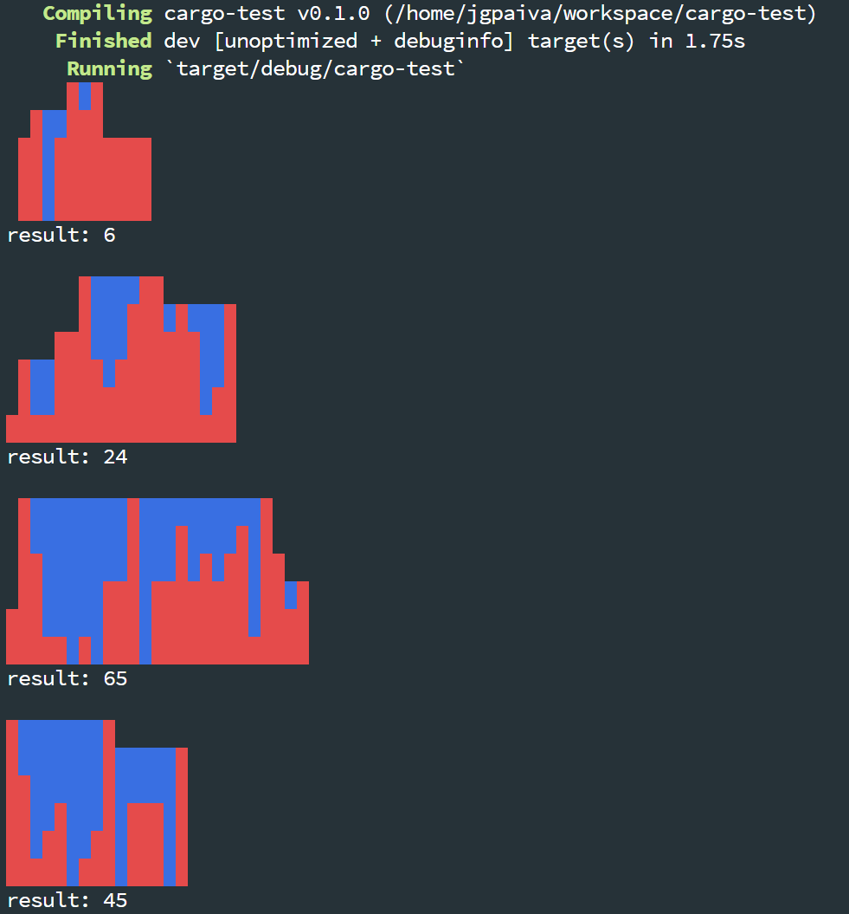

# Minesweeper solver

This is an attempt at building a minesweeper solver. Right now it is just a
complete console and WASM implementation of the game and has no solver.

## Demo

You can play the WASM version online [here](https://jgpaiva.github.io/minesweeper/).

## How to run localy

After installing rust and cargo, run `wasm-pack build --dev --target web`. After
this, start a server on the local folder (e.g. `python3 -m http.server`) and
check it out on your favourite browser.

## Example output

